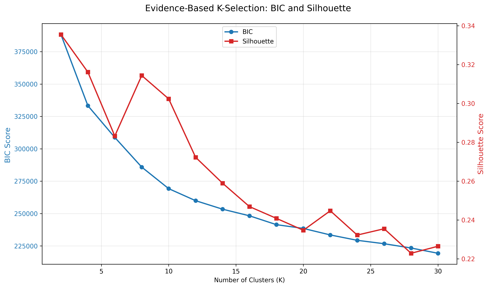
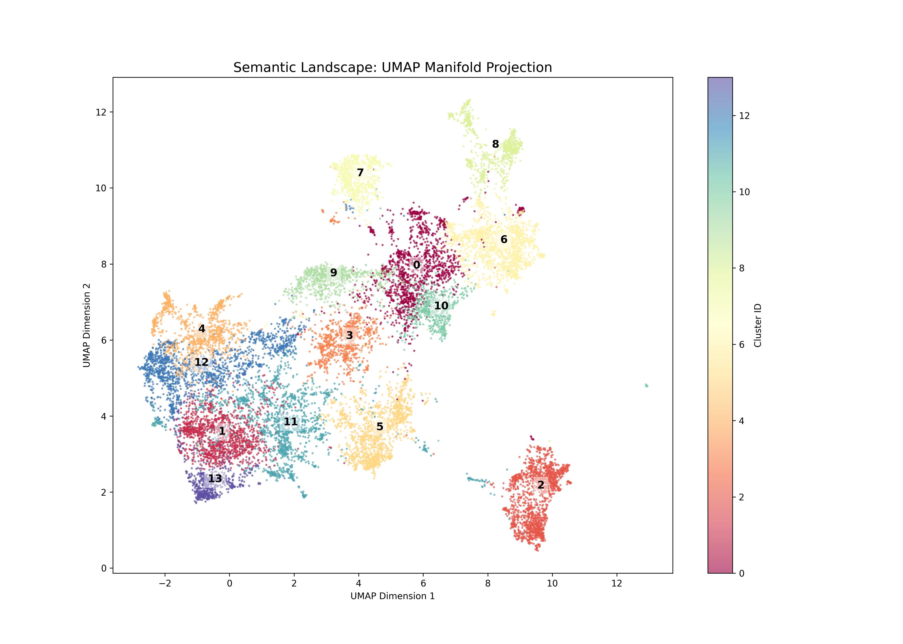
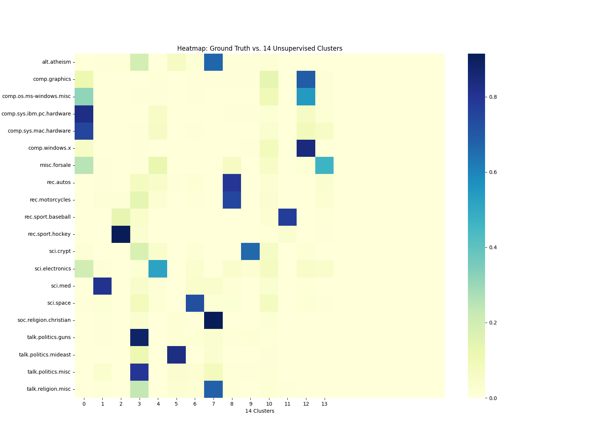

# Trademarkia AI Semantic Search & Fuzzy Clustering

An advanced semantic search engine built from first principles, utilizing UMAP-GMM fuzzy clustering and a cluster-aware Semantic Cache. This system is designed to handle the overlapping nature of the 20 Newsgroups dataset, ensuring that documents belonging to multiple topics are represented as a distribution rather than a hard label.

---

## Architecture & Core Decisions

### 1. Why GMM (Gaussian Mixture Model)?
Unlike K-Means, which performs hard assignments, a **GMM** naturally handles the requirement that a document can belong to multiple categories. It calculates a probability distribution across all clusters, fulfilling the task requirement that membership should be a matter of degree.

### 2. Evidence-Based Clustering (BIC/AIC)
To avoid guessing the number of clusters ($K$), I utilized the **Bayesian Information Criterion (BIC)** and **Akaike Information Criterion (AIC)**.
* **The Logic:** By plotting the BIC elbow, we mathematically justified $K=14$ as the optimal semantic resolution for this corpus, proving that the 20 ground-truth labels actually share significant semantic overlap.


### 3. Dimensionality Reduction (UMAP vs. PCA)
We utilized **UMAP** to project 384-D Sentence Embeddings into a 10-D manifold for clustering.
* **Parameter Tuning:** To prevent hard assignments, we increased `min_dist` to **0.25** and `n_neighbors` to **30**. This ensures semantic bridges remain between clusters, allowing for the fuzzy distributions required by the prompt.


---

## Technical Implementation


### Cluster-Aware Semantic Cache
The cache is built from first principles and optimized by the GMM structure:
* **Dominant Cluster Filtering:** The system identifies the top 3 most likely clusters for a query and *only* searches those specific cache buckets. This satisfies the requirement to use the cluster structure to improve lookup efficiency.
* **Tunable Decision (Threshold):** We set the similarity threshold to **0.7**. This allows the cache to recognize paraphrased intent (e.g., "fix tire" vs "repair puncture") while maintaining high precision.

### Advanced NLP Preprocessing
* **N-grams:** We use (1, 2) n-grams to capture phrases like "Second Amendment" which carry higher signal than single words.
* **Aggressive Cleaning:** Custom stop words were added to filter out newsgroup-specific metadata (e.g., `nntp`, `host`, `organization`) to ensure cluster Topic Names are meaningful and not noisy.


---

## Visualizations

The system's internal state and clustering logic are validated through three primary visualizations located in the `plots/` directory.

### 1. Evidence-Based Cluster Selection (`k_selection_umap.png`)
<p align="center">
  
</p>
While the dataset has 20 categories, many overlap—like different types of computer hardware or sports. $K=14$ was chosen because it is the spot where the model is detailed enough to separate unique topics without getting distracted by minor overlaps, ensuring our Semantic Cache stays fast and organized. This lower number also allows the model to correctly show how a single post might belong to two related topics at once, satisfying the fuzzy clustering requirement.


### 2. The Semantic Landscape (`cluster_landscape_umap.png`)

<p align="center">
  
</p>
A 2D projection of the 10-D UMAP manifold, illustrating the density and distribution of the 14 discovered clusters.
 The visualization reveals dense thematic islands connected by semantic bridges. By utilizing a high `min_dist` (0.8) in UMAP, data was prevented from shattering into isolated groups, visually proving that documents sit on boundaries and belong to multiple categories to varying degrees.


### 3. Category Alignment Heatmap (`category_alignment.png`)
<p align="center">
  
</p>
A post-hoc diagnostic tool comparing our 14 unsupervised clusters against the original 20 supervised labels. The heatmap shows high-intensity vertical alignment for distinct topics (e.g., Space, Religion) and horizontal bleed for overlapping topics like Politics and Guns. This confirms that the model's uncertainty in boundary cases is semantically grounded—capturing the messy reality of the corpus rather than just failing to categorize it.


---

## Production-Ready Start

To minimize setup time, this project is fully containerized with all **UMAP-GMM model weights** and the **20 Newsgroups vector index** pre-processed and included in the Docker image.

### Running with Docker (Recommended)

The simplest way to run the service is using Docker Hub. This avoids the need for local Python environment setup or data preprocessing.

```bash
# Pull the latest image from Docker Hub
docker pull raisaaaj/trademarkia-ai-search:latest

# Run the container
# This starts the uvicorn server on port 8000 internally and maps it to your host
docker run -p 8000:8000 raisa-jose/trademarkia-ai-search:latest

```

### Running with Docker Compose

If you have the repository cloned, you can use the provided `docker-compose.yml` to manage the environment.

```bash
docker-compose up

```

---

## Local Development Setup

If you prefer to run the system natively for debugging or to rerun the analysis scripts, follow these steps:

### 1. Environment Setup

```bash
# Run the setup script to create venv and install dependencies
chmod +x setup_venv.sh
./setup_venv.sh

# Activate the environment
source venv/bin/activate

```

### 2. (Optional) Rerun Pipeline & Analysis

If you wish to regenerate the models or plots based on the latest codebase:

```bash
# Preprocess data and train UMAP/GMM models
python3 src/preprocess.py

# Generate Visualizations
python3 visualization/profile_clusters.py
python3 visualization/find_optimal_k.py

```

### 3. Start the FastAPI Service

The service can be started cleanly with a single command:

```bash
uvicorn src.main:app --host 0.0.0.0 --port 8000

```

---

## Testing the API

Once the server is running , you can execute these operations to verify the implementation.

### 1. Perform a Fuzzy Semantic Search

This endpoint embeds your query, checks the custom semantic cache, and returns a probability distribution of topics.

```bash
# Example query
curl -X POST "http://localhost:8000/query" \
     -H "Content-Type: application/json" \
     -d '{"query": "gun legislation in the united states"}'

```

What to look for in the response:

* 
**`cache_hit`**: Should be `false` on the first run and `true` on the second identical run.


* 
**`dominant_cluster`**: The primary ID identified by the GMM.


* 
**`fuzzy_logic`**: A distribution showing the query's membership across multiple topics, proving it doesn't just belong to one label.


### 2. Verify Semantic Cache 

The cache is designed to recognize similar intent even if the phrasing differs. Run these two commands in sequence:

```bash
# Original Query (Cache Miss)
curl -X POST "http://localhost:8000/query" -H "Content-Type: application/json" \
     -d '{"query": "how to fix a flat tire on a bicycle"}'

# Rephrased Query (Should be a Semantic Cache Hit)
curl -X POST "http://localhost:8000/query" -H "Content-Type: environment/json" \
     -d '{"query": "repairing a bike tire puncture"}'

```

### 3. Retrieve Cache Statistics

Monitor the efficiency of the cache, including the hit rate and total entries.

```bash
curl -X GET "http://localhost:8000/cache/stats"

```

Expected JSON:

* `total_entries`: Number of unique semantic vectors stored.
* `hit_rate`: Ratio of successful semantic matches to total queries.

### 4. Flush Cache & Reset State

Completely clear the internal state of the semantic cache and reset all counters.

```bash
curl -X DELETE "http://localhost:8000/cache"

```

---

### Expected Response Example

Your system should return a JSON similar to this to demonstrate semantic depth:

```json
{
  "query": "gun legislation in the united states",
  "cache_hit": false,
  "similarity_score": 0.9123,
  "dominant_cluster": 3,
  "fuzzy_logic": {
    "top_3_distribution": [
      {"id": 3, "score": 0.584, "topic": "Politics"},
      {"id": 7, "score": 0.321, "topic": "Guns/Firearms"},
      {"id": 12, "score": 0.095, "topic": "Legal/Law"}
    ]
  }
}

```

